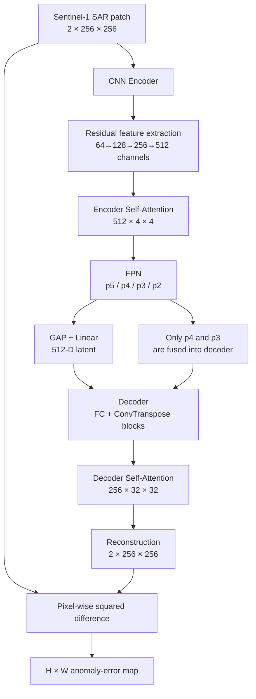

# Model and Anomaly Detection：源码级面试事实源

> 本章只解释当前项目所需的模型知识。`VERIFIED` 表示源码直接支持；“设计动机/可能收益”是合理解释，不等于仓库已有 ablation 证明。
>
> 训练 runtime 与 loss 尺度见 [04-training-and-performance.md](./04-training-and-performance.md)；normalization 与 train–serving skew 见 [02-data-pipeline.md](./02-data-pipeline.md)和 [06-engineering-review.md](./06-engineering-review.md)；简历 claim 边界见 [07-resume-evidence-matrix.md](./07-resume-evidence-matrix.md)。

## 1. Model Big Picture



### 训练阶段学习什么

训练样本按项目设计只包含正常森林。模型输入 `x`，目标也是 `x`，通过最小化平方重建误差学习参数：

```text
normal SAR patch x → encoder/decoder → reconstruction x_hat ≈ x
```

它没有学习“毁林/非毁林”分类边界，也没有用 512-D latent 接分类器。训练的实际 loss 是 batch 内全部通道和像素的 squared error sum；详见 [04 的 Loss 章节](./04-training-and-performance.md#5-loss源码叫-mse真实是-batch-sum-of-squared-errors)。

### 推理阶段真正使用什么

推理并不把 latent 当分类结果。真正的 detection signal 是：

```text
input x 与 reconstruction x_hat 的逐像素误差
→ VV/VH 两通道求和
→ H×W reconstruction-error map
→ clustering + spatial/temporal post-processing
```

512-D latent 是重建路径的一部分，不是 512 个类别，也不是最终 anomaly score。

## 2. Exact Tensor Shapes

以下 shape 省略 batch 维；实际运行均为 `B×C×H×W`。

### Encoder and FPN

| Stage | Operation | Output shape | Used by |
|---|---|---:|---|
| Input | VV/VH tensor | `2×256×256` | initial conv |
| Initial | `7×7 Conv, stride=2` + BN + LeakyReLU | `64×128×128` | encoder1 |
| Encoder 1 | 2 residual blocks；首块 stride 2 | `64×64×64` = x1 | only encoder2 |
| Encoder 2 | 2 residual blocks；首块 stride 2 | `128×32×32` = x2 | encoder3 + FPN p2 lateral |
| Encoder 3 | 2 residual blocks；首块 stride 2 | `256×16×16` = x3 | encoder4 + FPN p3 lateral |
| Encoder 4 | 2 residual blocks；首块 stride 2 | `512×8×8` = x4 | encoder5 + FPN p4 lateral |
| Encoder 5 | 2 residual blocks；首块 stride 2 | `512×4×4` = x5 | encoder attention |
| Encoder attention | spatial self-attention + residual + BN | `512×4×4` | p5 lateral |
| FPN p5 | `1×1 lateral(x5)` → `3×3 output conv` | `256×4×4` | output-conv p5 → latent；pre-output p5 → p4 top-down |
| FPN p4 | `1×1 lateral(x4) + upsample(pre-output p5)` → output conv | `256×8×8` | output-conv p4 → decoder；pre-output p4 → p3 top-down |
| FPN p3 | `1×1 lateral(x3) + upsample(pre-output p4)` → output conv | `256×16×16` | output-conv p3 → decoder；pre-output p3 → p2 top-down |
| FPN p2 | `1×1 lateral(x2) + upsample(p3)` → output conv | `256×32×32` | **returned but unused by decoder/output** |
| GAP | `AdaptiveAvgPool2d(1)` on p5 | `256×1×1` | flatten |
| Flatten | flatten from dimension 1 | `256` | Linear |
| Latent | `Linear(256,512)` | `512` | decoder FC |

注意：x1 没有 lateral connection。FPN 从 x2/x3/x4/x5 构造 p2–p5。

### Decoder

| Stage | Operation / fusion | Output shape |
|---|---|---:|
| Latent | input vector | `512` |
| FC | `Linear(512,256×4×4)` + LeakyReLU + reshape | `256×4×4` |
| Decoder 1 | transposed conv, ×2 spatial | `256×8×8` |
| FPN fusion 1 | element-wise `+ p4` | `256×8×8` |
| Decoder 2 | transposed conv | `256×16×16` |
| FPN fusion 2 | element-wise `+ p3` | `256×16×16` |
| Decoder 3 | transposed conv | `256×32×32` |
| Decoder attention | spatial self-attention + residual + BN | `256×32×32` |
| Decoder 4 | transposed conv | `128×64×64` |
| Decoder 5 | transposed conv | `64×128×128` |
| Decoder 6 | transposed conv | `32×256×256` |
| Final | `3×3 Conv(32→2)` + Tanh | `2×256×256` |

### FPN usage facts

- p4 和 p3 通过 element-wise addition 直接进入 decoder。
- p2 被计算并返回，但 decoder 从未读取 `fpn_features[3]`。
- p5 **不是 decoder direct skip**。它参与 latent 生成，也通过 top-down 路径影响 p4/p3，但 decoder 没有把 p5 直接加到 `256×4×4` feature。
- 因为 p2 不参与 reconstruction output，p2 专属的 `lateral_conv4` 与 `fpn_conv4` 不在 loss 到 output 的计算依赖路径上；正常 backward 中这些参数不会从 reconstruction loss 得到梯度。它们仍消耗 forward compute，属于 dead branch 风险。

## 3. Why Autoencoder?

项目约束是：正常森林 SAR 影像相对容易获得，而高质量、逐像素毁林标注有限，QGIS 人工标注成本高。目标也不是给整张 patch 一个类别，而是寻找空间上的异常/变化候选。因此选择了 normal-only reconstruction learning：

```text
Normal forest
→ near patterns learned from normal training data
→ reconstructed relatively well
→ low reconstruction error

Deforested or other out-of-distribution region
→ differs from learned normal patterns
→ reconstructed relatively poorly
→ high reconstruction error
```

它的实际优势：训练模型参数时不需要大量毁林 pixel labels，还能产生 H×W 空间 error map。

但这只是核心假设，不是数学保证。Autoencoder 并不知道“毁林”的语义；它只知道输入模式是否容易被当前模型重建。

## 4. Reconstruction Anomaly Detection

给定输入 `x` 和重建 `x_hat`，每个通道、每个位置的 squared error 是：

\[
e_{c,h,w}=(x_{c,h,w}-\hat{x}_{c,h,w})^2
\]

当前 inference 把两个通道相加：

\[
E_{h,w}=e_{VV,h,w}+e_{VH,h,w}
\]

于是每个 `2×256×256` patch 得到一个 `256×256` scalar error map。

### Training loss vs inference map

| Phase | Code behavior | Result |
|---|---|---|
| Training | `F.mse_loss(..., reduction='sum')` | 对 batch、channel、H、W 全部求和，得到一个 scalar；epoch 再除样本数 |
| Inference | `MSELoss(reduction='none')` then `.sum(dim=1)` | 保留 H/W，只对 VV/VH channel 求和，得到每样本 H×W map |

二者使用相同的 squared-difference primitive，但 reduction 目的不同：训练需要一个可 backward 的 scalar；检测需要保留空间位置。

为什么 squared error 合理：实现简单、可微，并且会对较大偏差给予更强惩罚。但它也对 outlier、尺度和 normalization 很敏感，不能把“MSE 常用”当成最优性证明。

## 5. Failure Modes of Reconstruction Anomaly Detection

### 为什么正常区域也可能重建不好

- 正常森林本身有未覆盖的地域差异。
- 季节、湿度或采集条件改变。
- 地形/传感器 artifact 产生训练中少见的模式。
- 模型容量过小，连正常纹理也无法表达。
- BatchNorm running statistics 或输入 batch 行为不一致。
- training/inference normalization 不一致；当前仓库确实存在该问题。

后果是 false positive：高 error 被当作毁林候选，但其实只是 unseen normal/domain shift。

### 为什么异常区域可能重建很好

- 模型容量过高，学会接近 identity mapping，而不是只表示正常分布。
- p4/p3 FPN skip 提供了较丰富的空间特征，帮助复制输入中的异常。
- 某些毁林模式简单、平滑，本身容易重建。
- 异常外观在正常训练数据中已有相似结构。
- threshold/clustering 将其划入低误差 component。

后果是 false negative：真实毁林 error 不够高。

必须背熟：

> High reconstruction error 不等于“确定毁林”；它只表示输入模式与模型学到的正常重建分布不同。毁林是通过数据假设、空间过滤、时间比较和人工标注评价赋予的下游解释。

## 6. Residual Block

源码真实结构：

```text
main branch:
x → 3×3 Conv(stride) → BN → LeakyReLU
  → 3×3 Conv(stride=1) → BN

identity branch:
x → identity
or x → 1×1 Conv(stride) → BN

add → LeakyReLU
```

即：

\[
y=\operatorname{LeakyReLU}(F(x)+P(x))
\]

若 shape 不变，`P(x)=x`；否则是 projection。

### 为什么有用

- 提供更直接的 gradient path，缓解深层网络优化困难。
- 主分支只需学习相对 identity 的 residual transformation。
- identity path 帮助保留已有信息。

这些是合理动机；仓库没有 plain-CNN 对照实验来量化独立贡献。

### 为什么需要 1×1 projection

例：encoder2 的第一块：

```text
input identity: 64×64×64
main output:    128×32×32
```

两者不能直接相加。projection 使用：

```text
1×1 Conv, stride=2, channels 64→128
→ BN
→ 128×32×32
```

它同时完成 spatial downsampling 和 channel conversion，使 element-wise addition shape 对齐。源码条件是：`stride != 1 or in_channels != out_channels`。

## 7. FPN：当前代码怎样计算

```text
x5: 512×4×4
  → lateral 1×1: 256×4×4
  → p5 output 3×3: 256×4×4

x4: 512×8×8 → lateral 1×1: 256×8×8
  + nearest-upsample(p5 pre-output path)
  → p4 → output 3×3: 256×8×8

x3: 256×16×16 → lateral 1×1: 256×16×16
  + nearest-upsample(p4 top-down tensor)
  → p3 → output 3×3: 256×16×16

x2: 128×32×32 → lateral 1×1: 256×32×32
  + nearest-upsample(p3 top-down tensor)
  → p2 → output 3×3: 256×32×32
```

更精确地说，top-down additions 先构造 p5/p4/p3/p2 中间 tensor，之后各自通过 output `3×3` conv；下一级 top-down 使用的是上一级 output conv **之前**的 tensor。

- `1×1 lateral conv`：把不同 encoder stage 的 channel 都统一为 256。
- top-down interpolation：用 nearest interpolation 把低分辨率高层 feature 放大到 lateral feature 的 H/W。
- feature addition：要求 channel 和 spatial shape 都一致，把局部空间信息与更高层 context 合并。

## 8. Why FPN in an Autoencoder?

FPN 常见于 detection，但它本质是 multi-scale feature fusion，并不限于分类或检测。在 reconstruction 中：

- 高层 feature 分辨率低、receptive field 大，提供更大范围的 context。
- 较低层 feature 分辨率更高，保留更多局部位置和边界细节。
- decoder 需要从 compact latent 恢复空间结构，p4/p3 可以补充 multi-scale information。

项目中的合理设计动机是改善小区域和空间细节的重建。不过当前 repository 没有完整 ablation，所以只能说“设计用于/可能帮助”，不能说“已证明 FPN 提升 F1”。

## 9. Critical Challenge：FPN Skip vs Anomaly Detection

### 风险

Reconstruction anomaly detection 希望 bottleneck 只保留正常模式。如果 decoder 获得太直接、太高分辨率的 encoder feature，可能绕过 bottleneck：

```text
anomalous input
→ skip carries anomaly detail
→ decoder reconstructs anomaly well
→ error decreases
→ false negative increases / recall decreases
```

当前 decoder 加入 p4 `8×8` 和 p3 `16×16`，没有加入 p2 `32×32`，更没有 x1 `64×64` 或原图级 skip。因此它不像完整 U-Net 那样把最高分辨率信息直接送入 decoder。这可以被理解为“部分 multi-scale detail 与 anomaly sensitivity 的折中”。

但必须诚实：源码/报告没有证据证明“不用 p2”是经过严格验证的 intentional anomaly-design decision。它也可能只是未完成或未清理的实现，尤其 p2 分支仍被计算。

### 如何验证

最小 ablation：

| Model | Change |
|---|---|
| A | plain CNN AE |
| B | A + Residual |
| C | B + FPN；分别测试 no skip、p4、p4+p3、p4+p3+p2 |
| D | C + encoder/decoder attention |

保持 dataset split、normalization、seed policy、training budget、checkpoint selection、GMM/threshold 和 evaluation AOI 一致。比较：

- normal reconstruction error distribution；
- GT anomaly reconstruction error distribution；
- 两者分离度，例如 AUROC/AUPRC 或 distribution overlap；
- Precision、Recall、F1、IoU；
- 参数量、延迟和显存。

不能只看 validation reconstruction loss，因为它主要由正常森林组成。

## 10. Self-Attention：当前实现

对输入 `x ∈ R^(B×C×H×W)`：

```text
Q = 1×1 Conv: C → C/8
K = 1×1 Conv: C → C/8
V = 1×1 Conv: C → C
N = H×W

Q → B×N×C'
K → B×C'×N
QK → B×N×N
softmax on last dimension

V → B×C×N
V × attention^T → B×C×N → B×C×H×W

out = BatchNorm(gamma × attention_output + x)
```

`gamma` 是可学习 scalar，初始值为 `0.1`。它控制 attention 分支相对 identity 的贡献：训练可以增大、减小甚至改变其符号，而 residual `+x` 保留原 feature path。

源码事实边界：这是单个 spatial self-attention block，不是 Transformer architecture，也不是 multi-head attention；实现没有显式 `1/sqrt(d)` scaling，并且 forward 只返回 feature，不返回 attention matrix供下游分析。

## 11. Why Attention at Low Resolution?

Spatial attention 的 token 数是 `N=H×W`，attention matrix 大小 `N×N`，其核心空间复杂度近似 `O(N²)`。

### Encoder：4×4

```text
N = 4×4 = 16
matrix = 16×16 = 256 elements
float32 raw matrix ≈ 1,024 bytes = 1 KiB / sample
```

### 如果直接放在 256×256

```text
N = 256×256 = 65,536
matrix = 65,536² = 4,294,967,296 elements
float32 raw matrix = 17,179,869,184 bytes ≈ 16 GiB / sample
```

这还没有包括 Q/K/V、其他 activation、batch 和 backward。因此把 attention 放在低分辨率 feature 上可以大幅降低内存/计算，同时利用深层 feature 的大 receptive field 建模远距离空间关系。

## 12. Decoder Attention Memory

Decoder attention 位于 `256×32×32`：

```text
N = 32×32 = 1,024
attention matrix = 1,024×1,024
                 = 1,048,576 elements / sample
float32 raw storage = 4,194,304 bytes ≈ 4 MiB / sample
```

相比 encoder 的 256 elements，它大 `1,048,576 / 256 = 4,096` 倍。batch size 8 时，单个 raw attention matrix 理论上约 32 MiB；实际 training 显存还包含 Q/K/V、softmax/intermediate、autograd saved tensors、其他 feature maps、gradients 和 allocator overhead，因此不能把 32 MiB 当完整模型显存。

这是当前模型明确的 activation hotspot，也是 OOM 时应 profile 的位置；训练系统讨论见 [04 的 OOM 章节](./04-training-and-performance.md#17-cuda-oom-troubleshooting)。

## 13. 512-D Latent

真实路径：

```text
p5: 256×4×4
→ AdaptiveAvgPool2d(1)
→ 256×1×1
→ flatten
→ 256
→ Linear(256,512)
→ 512-D latent
```

Adaptive average pooling 对每个 channel 的 4×4 spatial values 求汇总，得到固定长度 representation；Linear 再映射为 512 维。

这个 latent 是 compact reconstruction representation，不是类别概率，也不是独立训练出的 anomaly embedding。`AE_Network` 把 output size 硬编码为 512，CLI 的 `--embedding-size=128` 对 AE 不生效；它只影响 VAE 路径。

“compact”是相对原始 `2×256×256 = 131,072` values 而言，但 decoder 还接收 p4/p3，所以整条信息通道不只有 512 个数。

## 14. Decoder

Decoder 先把 512 latent 映射为 `256×4×4`，随后使用 6 个 `ConvTranspose2d(kernel=4,stride=2,padding=1)` block，每个把 H/W 扩大 2 倍：

```text
512
→ FC → 256×4×4
→ 256×8×8  + p4
→ 256×16×16 + p3
→ 256×32×32 → self-attention
→ 128×64×64
→ 64×128×128
→ 32×256×256
→ Conv 32→2 + Tanh
→ 2×256×256
```

ConvTranspose2d 在这里的作用是 learnable spatial upsampling。每个 up block 后有 BatchNorm 和 LeakyReLU；最后一层不用 BN，而用 Tanh 限制输出范围。

p4/p3 使用 element-wise addition，不是 channel concatenation，因此不会增加 decoder channel 数，但要求两边都是 256 channels 且 H/W 相同。

## 15. Output Activation

当前最后是 Tanh，输出范围 `[-1,1]`；Dataset 训练输入设计上主要由 `[-15,-3]` 映射到约 `[0,1]`，且 Dataset 本身不 clamp。

这不是最自然的 range pairing：模型的负半轴不是主要 target range。但它不必然导致训练失败；MSE 仍可以把输出推向 `[0,1]` target。

今天应比较：

- `Sigmoid` + `[0,1]` input；
- `Tanh` + `[-1,1]` input；
- linear output + 明确的 range/loss policy。

必须在相同 split、training budget 和 anomaly post-processing 下做 ablation，而不是仅凭直觉替换。完整 P0 说明见 [06 的 Output Range Review](./06-engineering-review.md#f-tanh--11-output-vs-normalized-01-input)。

## 16. Single-Image KMeans Branch

函数：`reconstruct_and_analyze_images()`。

```text
one sample from normalized test Dataset
→ model.eval() + no_grad()
→ reconstruction
→ per-channel squared error
→ sum VV/VH → 256×256 pixel_loss
→ log(pixel_loss + 1e-8)
→ compute 1st and 99th percentiles on this image
→ clip to [p1,p99]
→ MinMax to [0,1]
→ KMeans(n_clusters=2, random_state=0)
→ compute mean normalized error of each assigned cluster
→ cluster with higher mean = anomaly
→ connected components, min_size=50
→ save visualization PNG
```

KMeans 只看到一维 normalized error values，不知道“森林”或“毁林”标签。代码通过比较两个 cluster 的 mean error，把较高均值 cluster解释为 anomaly。

该分支可按指定 index，或随机选择 test sample。随机路径会先 `list(self.test_loader)`，即物化全部 test batches 到 Python list，再随机选 batch；这对单图抽样不是内存友好的实现，但不改变模型算法定义。

## 17. Five-Image GMM Branch

源码有两个共享前半段的 5-image 函数：

```text
target date
+ 2 sorted images before
+ 2 sorted images after
→ require at least 5 valid images
→ each image independently through AE
→ each gets H×W VV+VH pixel-loss map
→ concatenate all 5 maps' raw loss values
→ GaussianMixture(n_components=2, random_state=0)
→ component with higher fitted mean = anomaly
→ GMM predict each image
→ connected-component filter, min_size=50
```

这里 GMM fit 使用原始 pixel loss，没有 single-image 分支的 log、percentile clip 或 `[0,1]` normalization。`mse_min=0,mse_max=1050` 只用于生成显示 heatmap，不参与 GMM classification。

### 两种时间解释

`reconstruct_and_analyze_images_by_time_sequence()` 按日期顺序维护累计 mask：

```text
current = anomaly now AND never anomalous in any earlier selected image
ancient = anomaly now AND anomalous at least once in any earlier selected image
previous_anomalies |= anomaly now
```

因此源码中的 `ancient` 更准确是“窗口内曾经出现过且当前再次出现”，不要求每一期连续异常，也不证明它真是历史毁林；第一张图的所有 anomaly 都会被标为 current。

`reconstruct_and_analyze_images_by_clustering()` 则计算相邻两期：

```text
difference_i = previous_map==0 AND current_map==1
```

它只生成可视化，不是 recurrent/sequence model。还有一个 P0 边界：当前这两条函数调用 preprocessing helper 时没有传入训练的 min/max，存在 train–serving skew；见 [02 的 Normalization](./02-data-pipeline.md#5-normalization本项目最重要的数据契约)。

## 18. Large-Area Two-Date GMM Branch

函数：`generate_large_change_map(target_date, prev_date, ...)`。

真实流程：

```text
explicit target date + explicit previous date
→ glob files and group by date
→ parse row/col from hard-coded filename regex
→ intersect target/previous tile coordinates
→ for every common tile and both dates:
     TIFF → CHW tensor → AE → raw VV+VH pixel-loss map
→ concatenate loss from all valid tiles and both dates
→ fit one shared 2-component GMM
→ higher-mean component = anomaly
→ predict target and previous map per tile
→ additionally clear pixels whose raw loss < 1.0
→ connected-component filter target, min_size=100
→ connected-component filter previous, min_size=100
→ difference = previous 0 AND target 1
→ connected-component filter difference again, min_size=100
→ rasterio.features.shapes using target tile transform
→ per-tile Shapefile + merged Shapefile
```

它比五期 visualization 分支更接近区域 deliverable，但有几个边界：

- GMM 同时使用 previous 和 target 的 test-time error distribution，属于 transductive post-processing。
- 固定 `pixel_loss_threshold=1.0` 在 GMM label 后追加，两个条件都要满足。
- 坏 tile pair 会被跳过，结果可能有未记录的空间缺口。
- `suffix_template` 和 `tile_size` 参数没有真正控制内部 regex/shape logic。
- 最严重的是该 loader 直接把原始 TIFF tensor 送入模型，没有训练的 `[-15,-3]` normalization。

## 19. KMeans vs GMM

| Aspect | KMeans | GMM in this project |
|---|---|---|
| Model | 距离 centroid，hard partition | 概率 mixture；一维时每 component估计 mean、variance 和 mixture weight |
| Assignment used | hard cluster label | `predict()` 最终也产生 hard component label，但来自 fitted probabilities |
| Shape assumption | 更接近 spherical/equal-scale clusters | 可表达不同 variance/weight 的 components |
| Project branch | single image after log/percentile/normalization | five-image and two-date raw pixel-loss distributions |

Reconstruction error 常出现大量低误差像素和较少高误差 tail；GMM 的 variance/weight flexibility可能比单纯 centroid 更适合描述这种分布。但仓库没有同协议 KMeans-vs-GMM benchmark，所以不能声称 GMM 已被证明更好。

## 20. Why Two Components?

`n_clusters=2` / `n_components=2` 来自简化假设：

```text
low-error normal group
vs
high-error anomaly group
```

现实可能同时包含：

- familiar normal forest；
- unseen normal forest；
- seasonal/moisture variation；
- sensor or preprocessing artifact；
- deforestation；
- other land-cover anomaly。

它们不保证组成恰好两个 cluster，更不保证服从两个 Gaussian。算法即使在没有真实异常时也会强制分两类。因此“高均值 component”只是 anomaly candidate，不是语义标签。

## 21. Connected Components

`_filter_small_components()` 使用 `scipy.ndimage.label(binary_map)` 标记连通区域，然后计算每个 component 的 pixel count：

```text
if component.sum() >= min_size:
    keep it
else:
    remove it
```

默认 connectivity 由 SciPy 对二维输入生成的默认结构决定，通常是正交邻接的 cross-shaped connectivity；源码没有显式选择 8-connectivity。

收益：孤立高误差 pixel 或很小 speckle region 更可能是噪声，删除后通常减少 FP、提高 precision，并使 GIS polygon 更干净。

代价：真实微小毁林也可能小于阈值，或者被分割成多个小 component，从而被删除，Recall 下降。源码 docstring 提到 opening/closing，但相关代码被注释；实际只做 connected-component size filtering。

## 22. Physical Meaning of `min_size`

在报告的约 `10m×10m/pixel` 假设下：

```text
one pixel = 100 m²

50 pixels = 5,000 m² = 0.5 hectare
100 pixels = 10,000 m² = 1 hectare
```

分支并不统一：

| Branch | `min_size` | Approximate physical area |
|---|---:|---:|
| Single-image KMeans | 50 | 0.5 ha |
| Five-image GMM maps | 50 | 0.5 ha |
| Large-area target/previous/difference | default 100 | 1 ha |

因此不能说“项目统一以 0.5 ha 为 detection threshold”。此外这是基于约 10 m ground sampling 的换算；投影、重采样和真实有效分辨率会影响严格物理解释。

## 23. Temporal Difference

Autoencoder 本身 **不是 temporal model**：每次 forward 只接收一张 `2×256×256` image，没有时间维、RNN、3D convolution 或跨日期 attention。

时间信息只出现在 post-processing：

```text
AE(image at t-1) → anomaly mask at t-1
AE(image at t)   → anomaly mask at t
compare masks: 0 → 1 candidate change
```

五期分支只是共享 GMM distribution并比较 masks；large-area 分支比较指定两日期。安全说法是“模型做逐图空间异常重建，时间变化在后处理层计算”，不能说“网络学习了时间序列”。

## 24. Why Not U-Net / Supervised Segmentation?

项目化回答：

> 当时容易获得的是大量正常森林 SAR patch，而逐像素毁林标注需要 QGIS 人工绘制和核验，规模有限。Supervised U-Net 直接学习毁林 mask，需要足够且代表性强的 pixel labels；在这个约束下，我选择 normal-only Autoencoder，用正常森林自重建训练，再从 reconstruction error 产生空间异常候选。它降低了训练标签需求，但代价是异常没有直接语义保证。若今天拥有大规模高质量标注，我会把 U-Net/segmentation 作为更直接的 baseline，而不会假设 AE 一定更好。

还要区分：本项目的 decoder 融合 p4/p3 feature，但它不是 supervised U-Net，也没有 segmentation loss。

## 25. Why Not Just Threshold Reconstruction Error?

固定 threshold 简单、易部署，也更适合严格 frozen detector；但不同日期、区域或采集条件下，normal error distribution 可能漂移，同一个 threshold 的 false-positive rate 会变化。

KMeans/GMM 利用当前待分析 error distribution，自适应分出低/高 error groups，不需要人工指定唯一 cluster boundary。但代价是：

- 每批测试数据都会改变 detector；
- 无异常时仍强制分组；
- 异常占比变化会改变拟合；
- test distribution参与后处理 fitting。

因此 test-time GMM 虽然无标签，仍是 transductive。它不能等同于 validation 上确定并冻结的 untouched holdout detector；完整评价风险见 [06 的 Transductive GMM](./06-engineering-review.md#e-transductive-gmm-post-processing)。

## 26. Model Capacity Trade-Off

```text
AE too weak
→ normal forest reconstructed poorly
→ normal error high
→ false positives / low precision

AE too powerful or skips too direct
→ anomaly also reconstructed well
→ anomaly error low
→ false negatives / low recall
```

因此 anomaly-detection AE 的目标不是简单的“所有 reconstruction loss 越低越好”，而是让正常与异常 error distribution 可分。

Validation set 按项目设计也主要/只含正常森林，所以 validation reconstruction loss 能衡量正常重建与过拟合趋势，却不能直接衡量 anomaly separation。最低 validation loss 的模型可能把异常也重建得更好，最终 F1 反而下降。

理想 selection 应同时使用：正常 validation error、单独标注 calibration/evaluation region 的 anomaly separation，以及固定协议的 Precision/Recall/F1/IoU。标签只用于选择/评价时，要明确避免反复调 test set。

## 27. What Would Proper Ablation Look Like?

### 最小模型序列

```text
A: plain CNN Autoencoder
B: A + Residual blocks
C: B + FPN; explicitly vary p4/p3/p2 skips
D: C + encoder and decoder Self-Attention
```

### 控制变量

- 同一个 spatial split 与 dataset manifest；
- 同一个 preprocessing/normalization；
- 相同 optimizer、训练预算、seed policy；
- 相同 checkpoint selection；
- 相同 KMeans/GMM、threshold、min_size；
- 固定且 prediction-independent 的 evaluation AOI/grid。

### 比较指标

- normal reconstruction error distribution；
- GT anomaly error distribution；
- separation/overlap；
- Precision、Recall、F1、IoU；
- latency、peak GPU memory 和参数量。

当前 repository 没有完整 ablation artifacts，因此不能给 Residual、FPN、Attention 各自分配量化提升，也不能声称最终组合优于所有更简单模型。

## 28. What Is Actually Novel?

这不是新的深度学习理论。更准确的定位是 application/engineering integration：

```text
针对 Sentinel-1 微毁林任务
→ 组合并适配 CNN Autoencoder
→ Residual feature extraction
→ FPN multi-scale fusion
→ spatial Self-Attention
→ reconstruction-error anomaly map
→ KMeans/GMM + connected components
→ temporal mask comparison
→ georeferenced vector/GIS output
```

项目价值在完整 prototype、数据与模型接口、实验链路、后处理和 GIS 落地，而不是“发明 FPN/self-attention/anomaly detection”。

## 29. Model Limitations

| Category | Limitation | Consequence |
|---|---|---|
| Model assumption | normal-only learned distribution能够代表未来正常森林 | unseen normal/seasonal domain shift 产生 FP |
| Model capacity | 太弱重建不好正常；太强也能重建异常 | precision/recall 两端风险 |
| Architecture | p4/p3 skip 可能传递异常细节 | anomaly error 和 recall 下降 |
| Architecture | p2 计算但不参与 output | dead branch、额外 compute、参数无 reconstruction gradient |
| Architecture | decoder attention matrix较大 | 显存与计算热点 |
| Output design | Tanh `[-1,1]` vs input约 `[0,1]` | range pairing不自然，需 ablation |
| Engineering bug | temporal/large-area inference normalization 不一致 | error 可能反映尺度而非毁林 |
| Post-processing | GMM 强制两个 components | 复杂/无异常分布也被二分 |
| Evaluation protocol | test-time GMM | transductive，不是完全 frozen holdout |
| Hyperparameters | manual loss threshold 和 min_size | 跨区域/日期泛化不确定；小事件被过滤 |
| Temporal modeling | network逐图处理 | 不能声称学习 temporal dynamics |
| Evidence | 缺完整 ablation | 无法证明各模块独立贡献 |
| Evaluation limitation | prediction-dependent annotation clipping | 潜在 FN 漏计，报告指标不可严格复现 |

其中 normalization 是工程正确性 bug；FPN/capacity/二分假设是模型或设计 trade-off；annotation clipping 是评价协议问题。不要把三类问题混为一谈。

## 30. 面试知识分级

### Level A — 必须掌握（15 条）

1. 输入输出都是 Sentinel-1 VV/VH `2×256×256`。
2. 模型只用正常森林做自重建训练，推理使用 pixel reconstruction error，不是 latent classification。
3. encoder shape：`64×128² → 64×64² → 128×32² → 256×16² → 512×8² → 512×4²`。
4. p5/p4/p3/p2 都计算，但 decoder 只直接融合 p4、p3；p5 不作 direct skip，p2 不使用。
5. latent 是 p5 经 GAP `256→Linear→512`，不是类别。
6. Residual block 是 `F(x)+identity`；stride/channel变化时用 `1×1` projection。
7. FPN 用 lateral `1×1` 统一 256 channels，再 top-down upsample/add。
8. FPN 可帮助空间细节重建，也可能让异常重建过好；仓库无 ablation 定论。
9. encoder attention 在 `4×4`；decoder attention在 `32×32`，后者 matrix 是 `1024²`。
10. training loss 全元素 sum；inference只跨 VV/VH求和，保留 H×W map。
11. 高 reconstruction error只表示偏离 learned normal reconstruction distribution，不等于确定毁林。
12. 单图用 KMeans；五期和两日期大区域用 2-component GMM，高均值 cluster作为 anomaly。
13. connected components 删除小区域，通常提高 precision，但可能降低 recall。
14. 50 pixels约 0.5 ha；大区域默认 100 pixels约 1 ha。
15. Autoencoder不是 temporal model；时间信息来自 anomaly masks 的日期间比较。

### Level B — ML/PyTorch 追问

- Q/K/V、`N×N` attention 和 `gamma` residual。
- decoder attention 的 raw memory 估算。
- sum loss 与 pixel map reduction 差异。
- GMM 的 mean/variance/mixture weight 与 KMeans centroid 差异。
- model capacity 和 anomaly separation 的关系。
- validation reconstruction loss为何不等于 anomaly F1。
- skip-depth ablation、output activation ablation。
- p2 dead branch为何没有 reconstruction gradient。

### Level C — 不优先花时间

- FPN、ResNet、self-attention 的论文历史。
- attention scaling、多头变体的理论细节。
- SAR scattering、speckle 和极化的深入物理推导。
- GMM EM 完整推导和 covariance estimator 数学。
- U-Net/Transformer/Foundation Model benchmark综述。
- 遥感 SOTA 或论文 novelty comparison。

## 31. Interview Questions（45–90 秒项目化回答）

### 1. 为什么用 Autoencoder？

> 项目里正常森林 SAR 数据比较多，但逐像素毁林标注需要 QGIS 人工制作，规模有限。我因此选择 normal-only Autoencoder：让模型只学习正常森林的 VV/VH 重建，再用输入与重建的逐像素误差找分布外区域。这样训练参数时不依赖毁林 mask，又能输出空间 anomaly map。代价是它没有直接学习毁林语义，所以高误差还需要聚类、空间过滤、时间比较和人工标注评价；有足够 labels 时我也会把 supervised segmentation作为 baseline。

### 2. 为什么 reconstruction error 能做 anomaly detection？

> 核心假设是模型只见过正常森林，因此正常模式更接近它学到的 reconstruction distribution，误差较低；毁林或其他分布外模式更难重建，误差较高。源码对 VV、VH 每个像素算 squared error，再跨两个 channel求和得到 `256×256` map。不过这不是数学保证：seasonal change也可能高误差，强模型也可能把毁林重建得很好，所以 error 是 anomaly signal，不是毁林概率。

### 3. 这个方法最大的假设是什么？

> 最大假设不是“Autoencoder 能重建”，而是正常和异常在 reconstruction error 上可分：正常森林代表性足够，模型容量又恰好不会把异常复制得太好。如果训练区没覆盖某种正常季节或地域，它会 false positive；如果 FPN skip 或模型容量太强，异常也可能低误差而 false negative。因此真正要验证的是 normal/anomaly error separation，而不是只看 validation loss。

### 4. Autoencoder 会不会把异常也重建出来？

> 会，这是 reconstruction anomaly detection 的经典风险。当前模型不仅有 512 latent，还有 p4/p3 FPN feature送入 decoder，它们可能传递异常空间细节，使毁林也重建得较好。项目没有完整 ablation，所以我不会声称这个风险已被排除。今天我会比较无 skip、p4、p4+p3 和再加 p2，观察正常与标注异常的 error distribution、Recall/F1 和显存，而不是只选 reconstruction loss最低的版本。

### 5. Residual connection 在你的项目里解决什么？

> Encoder 每个 stage 有两个 residual blocks。主分支做两层 `3×3 Conv+BN`，输出和 identity相加再 LeakyReLU。它给梯度和信息一个更直接的路径，让较深 encoder更容易优化。如果 stride或 channel改变，例如 `64×64×64` 到 `128×32×32`，identity不能直接加，源码就用 `1×1 stride-2 Conv+BN` 同时改 channel和下采样。这个结构有明确源码，但仓库没有 plain-CNN ablation来量化收益。

### 6. FPN 为什么会出现在 Autoencoder 里？

> FPN 虽常用于 detection，本质是多尺度融合。高层 `4×4/8×8` feature有更大 receptive field，低一些的 `16×16/32×32` feature保留更多位置细节；decoder重建空间结构时两者都可能有用。源码从 x5到x2生成 p5到p2，统一为 256 channels。不过实际 decoder只加 p4和p3，p5用于 latent和 top-down，p2被计算但没进入输出路径。

### 7. FPN 会不会反而影响 anomaly detection？

> 会有这个 trade-off。Skip能改善正常森林细节重建，但也可能绕过 bottleneck，把异常细节直接传给 decoder，导致异常误差降低、Recall下降。当前只融合 `8×8` p4 和 `16×16` p3，没有用更高分辨率 p2，这减少了最直接的 shortcut，但没有证据表明是经严格验证的最优折中。我会用固定后处理做 skip-level ablation，并同时看正常误差和异常 F1。

### 8. Self-Attention 放在哪里？为什么？

> 有两处：encoder bottleneck的 `512×4×4`，以及 decoder的 `256×32×32`。它用 Q/K 计算空间位置间 `N×N` 权重，再加权 V，并通过可学习 gamma残差加回输入。encoder低分辨率 attention成本很低，适合整合全局 context；decoder attention在恢复到 `32×32` 时再建模空间关系，但内存明显更高，是需要 profile的 hotspot。

### 9. 为什么 attention 不放在原图分辨率？

> 因为空间 attention对位置数 N 是平方复杂度。`4×4` 时 N=16，matrix只有 256 elements；`256×256` 时 N=65,536，matrix有 4,294,967,296 elements，单样本 float32 raw storage就约16 GiB，还没算QKV和反向。低分辨率既降低成本，又在深层 feature上利用较大的 receptive field。当前 decoder `32×32` matrix已达到约4 MiB每样本。

### 10. latent 512 是什么？

> p5 是 `256×4×4`，AdaptiveAvgPool压成 `256×1×1`，flatten后通过 `Linear(256,512)` 得到 512维 latent。它是 decoder重建输入的 compact representation，不是512类，也没有独立分类 loss。需要注意 decoder还接收p4/p3，因此总信息通道不只 latent；另外 AE把512硬编码，CLI `embedding-size` 对它无效。

### 11. 为什么用 MSE/squared error？

> 自重建需要比较连续值，squared error简单、可微，而且更强调较大偏差。训练源码对 batch、channel和空间全部求和；推理则 `reduction='none'` 后只跨VV/VH求和，保留H×W异常图。局限是它对 normalization和outlier敏感，当前推理 normalization不一致就是严重风险。因此我把它视为合理 baseline，不会声称一定优于L1或其他 reconstruction objective。

### 12. KMeans 和 GMM 分别在哪使用？

> 单图分支把 pixel error取log、做1/99 percentile clipping和归一化后，用两类KMeans。五期分支把五张图的原始 pixel loss合并，用两分量GMM；大区域分支把前后两日期所有共同tile的loss合并，拟合一个共享GMM。三条路径不能笼统说成“都用GMM”或“都用KMeans”，而且仓库没有同协议benchmark证明谁更好。

### 13. 为什么 GMM 使用两个 component？

> 它对应一个简化假设：低误差 normal和高误差 anomaly。但现实可能还有季节变化、湿度、sensor artifact、unseen normal和其他地物，不一定只有两个Gaussian。GMM即使没有毁林也会强制分两类，所以两分量是工程启发式，不是语义保证；我会监控component mean、variance和异常比例，并和冻结threshold baseline比较。

### 14. 怎么从 GMM 判断哪个 cluster 是异常？

> GMM component编号没有语义。源码fit后读取两个component mean，用 `argmax` 把平均 reconstruction error更高的component定义为anomaly，再用 `gmm.predict` 给每个pixel硬分配。它没有看ground-truth标签，这保持了无标签后处理，但“高误差=毁林候选”的假设仍需最终标注评价。

### 15. Connected Components 有什么作用？

> 聚类后的binary map可能有孤立高误差pixel。源码用 `scipy.ndimage.label` 找连通区域，按pixel count删除小于min_size的component。这样通常能减少噪声和FP，让Shapefile更干净；但真实小毁林也会被删，所以是precision-recall trade-off。源码提到opening/closing，但实际被注释，不能说项目执行了形态学开闭运算。

### 16. `min_size=50` 是多少实际面积？

> 按报告约10米乘10米一个pixel，每pixel约100平方米。50 pixels是5,000平方米，即0.5 hectare。但只有单图和五期分支常用50；大区域输出默认100 pixels，约1 hectare，而且target、previous和difference都会过滤。因此不能说整个项目统一检测0.5 hectare以上区域。

### 17. 为什么过滤小区域会影响 Recall？

> 因为过滤器只看component pixel count，不知道语义。小于阈值的孤立噪声会被正确删除，提高precision；但真实微毁林如果面积小于0.5或1 hectare，或者被聚类切碎成多个小块，也会被删掉，形成FN并降低Recall。阈值应在validation/calibration区域上按业务目标选择，并报告不同min_size的PR trade-off。

### 18. 你的模型是不是 temporal model？

> 不是。AE每次只接收一张双通道SAR image，没有时间维或时序网络。五期分支只是分别重建五张图、共享一个GMM，再比较anomaly masks；大区域分支比较指定前后日期的0→1变化。准确表述是“逐图空间异常检测加时间后处理”，不能说网络学到了时间序列。

### 19. 为什么不用 supervised U-Net？

> 当时大量的是正常森林数据，而逐像素毁林polygon需要QGIS人工标注，成本高且覆盖有限。U-Net更直接，但需要足够代表性的pixel labels；所以先用normal-only AE降低训练标签需求。代价是输出只有异常语义，seasonal变化也会触发。如果现在有更大高质量标签集，我会保留AE baseline，并把supervised segmentation作为必须比较的方案，而不是假设无监督一定更好。

### 20. 如果重新做，模型层面最先验证什么？

> 在修好统一normalization和固定evaluation AOI后，我最先做capacity/skip ablation，而不是加更复杂模块：plain AE、Residual、不同FPN skip组合、再加attention。我要同时看正常和标注异常的error distribution、Precision/Recall/F1/IoU，以及decoder attention显存。尤其验证p4/p3是否改善空间重建却降低异常separation，并移除当前无梯度的p2 dead branch。只有可信ablation后才决定保留哪些模块。

## 32. Five Challenge Questions

### A. FPN skip features 会不会让 anomaly 也重建得很好？

会。Decoder的目标是复制输入，skip越直接，越可能把异常细节也传过去。当前 p4/p3 分辨率为8×8和16×16，风险小于原图级skip，但仍存在；p4/p3也含来自top-down和encoder的输入相关信息。不能凭“没有p2”就断言安全。正确验证是控制其他变量，比较不同skip组合下 normal/anomaly error separation和Recall，而不是只比较normal reconstruction loss。

### B. Reconstruction loss 越低越好，为什么极强 AE 反而可能不适合 anomaly detection？

“越低越好”只对重建任务成立；异常检测依赖正常与异常的误差差距。极强AE可能近似通用identity function，让正常和异常都低误差，虽然validation reconstruction很好，detector却失去对比信号。相反太弱会让两类都高误差。目标是合适capacity和inductive bias，使normal低、anomaly相对高，而不是无条件最小化所有输入的误差。

### C. 为什么 validation reconstruction loss最低不一定 anomaly F1最高？

Validation按项目设计主要/只含正常森林，因此它测的是“正常重建有多好”。它没有测异常是否仍保持高误差，也没有包含GMM、threshold、connected components造成的precision/recall变化。一个更强skip模型可能把normal loss降得最低，同时也把deforestation loss降得更多，导致overlap增大、F1下降。因此checkpoint selection最好结合独立calibration labels或至少error-separation metric，不能把normal validation loss当完整downstream objective。

### D. Test-time GMM是无监督的，为什么不等同完全 untouched holdout？

因为“没有使用标签”和“没有使用测试数据做适配”是两件事。GMM在待评价日期/区域的loss上估计mean、variance和component boundary，所以detector参数随test distribution改变。这是合法的transductive protocol，但不是完全冻结的inductive detector。异常占比或季节分布不同会改变boundary。应分别报告validation-fitted frozen detector与test-time adaptive GMM，且不能称后者严格 untouched。

### E. 如果 seasonal variation error比真实毁林还高怎么办？

当前方法会优先把seasonal variation放进高误差component，造成FP，甚至让真实毁林落入相对低误差组。先从数据解决：相同季节训练/比较、统一normalization、增加多地区正常样本；然后在validation上分析按日期的normal error distribution，考虑season-conditioned calibration或冻结threshold。时间后处理可要求异常持续或使用多日期证据，但当前累计逻辑并不要求连续。最终必须用标注检查模型是在检测毁林还是季节/domain shift。

## 33. Cross References

- 完整训练 batch、sum loss、BatchNorm、checkpoint：见 [04-training-and-performance.md](./04-training-and-performance.md)。
- TIFF→tensor、`[-15,-3]`、DataLoader 和 train–serving skew：见 [02-data-pipeline.md](./02-data-pipeline.md)。
- normalization、transductive GMM、Tanh 和 evaluation P0 review：见 [06-engineering-review.md](./06-engineering-review.md)。
- Residual/FPN/Attention、GMM/KMeans 和指标的简历安全措辞：见 [07-resume-evidence-matrix.md](./07-resume-evidence-matrix.md)。

## 34. MODEL CHEAT SHEET

```text
Input:
  Sentinel-1 VV/VH, 2×256×256; normal forest for training

Encoder:
  64×128² → 64×64² → 128×32² → 256×16² → 512×8² → 512×4²
  Residual blocks; encoder attention at 4×4

FPN:
  p5 256×4², p4 256×8², p3 256×16², p2 256×32²
  decoder directly adds p4 and p3 only
  p5 creates latent/top-down context; p2 is computed but unused

Latent:
  p5 → GAP: 256 → Linear → 512-D
  not classes; CLI embedding-size does not control AE

Decoder:
  512 → FC → 256×4² → +p4 at 8² → +p3 at 16²
  → attention at 256×32² → 128×64² → 64×128² → 32×256²
  → Conv + Tanh → 2×256×256

Loss:
  training = squared error sum over batch/channel/spatial
  epoch log = average per-sample SSE

Anomaly Score:
  (x_VV-xhat_VV)² + (x_VH-xhat_VH)² → H×W map

Post-processing:
  single image: log + percentile + KMeans(2) + min_size 50
  five images: shared raw-loss GMM(2) + min_size 50
  large area: two-date shared GMM + loss≥1 + min_size 100 + vectorize

Temporal:
  network is NOT temporal; compare independently produced anomaly masks
  0→1 = new candidate change

Output:
  visualization PNG or georeferenced Shapefile; candidate regions, not certainty

Biggest Assumption:
  normal reconstructs better than deforestation/other anomaly

Biggest Model Risk:
  capacity/FPN skips reconstruct anomaly too well;
  seasonal/domain shift reconstructs normal poorly

Do Not Say:
  “latent performs classification”
  “all p2/p3/p4/p5 are decoder skips”
  “the network learns time series”
  “high error proves deforestation”
  “every branch uses GMM / every branch uses min_size=50”
  “ablation proved Residual, FPN and Attention each improved F1”
  “test-time GMM is a completely untouched frozen holdout”
```
